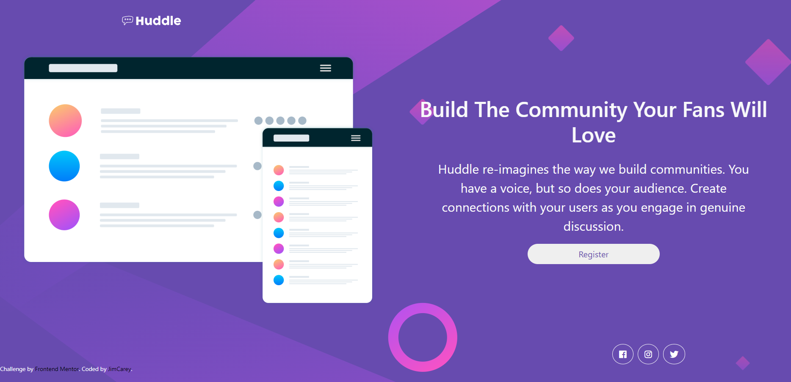

# Frontend Mentor - Huddle landing page with single introductory section solution

This is a solution to the [Huddle landing page with single introductory section challenge on Frontend Mentor](https://www.frontendmentor.io/challenges/huddle-landing-page-with-a-single-introductory-section-B_2Wvxgi0). Frontend Mentor challenges help you improve your coding skills by building realistic projects. 

## Table of contents

- [Overview](#overview)
  - [The challenge](#the-challenge)
  - [Screenshot](#screenshot)
  - [Links](#links)
- [My process](#my-process)
  - [Built with](#built-with)
  - [What I learned](#what-i-learned)
  - [Continued development](#continued-development)
  - [Useful resources](#useful-resources)
- [Author](#author)
- [Acknowledgments](#acknowledgments)

## Overview

### The challenge

Users should be able to:

- View the optimal layout for the page depending on their device's screen size
- See hover states for all interactive elements on the page

### Screenshot

### Links

- Solution URL: [Githun Repo](https://github.com/JimCarey08/huddle_landing-page_FrontEndMentor)
- Live Site URL: [Add live site URL here](https://your-live-site-url.com)

## My process

### Built with

- Bootstrap
- Semantic HTML5 markup
- CSS custom properties
- Flexbox
- CSS Grid
- Mobile-first workflow

### What I learned

I put on practice what i learn with bootstrap, and combine with my own css stylesheet , and i think it works great. Also thinks that bootstrap make the layouts and the responsive part a lot easier. This project teached me how specifity works on a better way because i had to inspect the links element and understand what class has priority to style, to modify the class to change the border color.

### Continued development

Bootstrap have a lot of classes, like A LOT a lot, so i think that knowing better the most importants classes is a challenge, but the practice makes better, so i will keep practicing with bootstrap a while.

### Useful resources

- [Bootstrap documentation](https://getbootstrap.com/docs/4.1/utilities/flex/) - This helped me to understand more about responsive design with bootstrap.

## Author

- Frontend Mentor - [@JimCarey08](https://www.frontendmentor.io/profile/JimCarey08)
- Twitter - [@LucasViCoisas](https://www.twitter.com/LucasViCoisas)

## Acknowledgments

Don't push yourself too much, give yourself a break, sanity is important too. If you're getting stressed, go outdoors and take a walk, things will getting better, you can do it!
